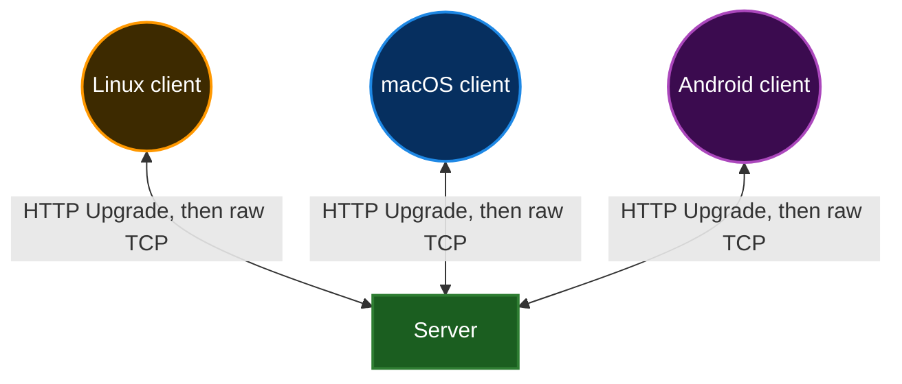

# MPClipboard

1. **M**ulti
2. **P**latform
3. **Clipboard**

This project implements a set of libraries and self-hosted apps (both desktop and mobile) to implement a shared clipboard buffer across multiple devices running on multiple platforms.

It requires a TCP server for communication (can be local if you only need it for devices that run in the same local network).

Key components:

+ [Server](/server) - self-hosted TCP server with optional TLS support (a single binary, <1MB of RAM).
+ [Generic client](/generic-client) - a cross-platform library that is the heart of all desktop/mobile apps listed below. It talks over TCP and implements a dead simple communication protocol. You can use it to build your own client for any platform. Written in Rust, has minimal [C bindings](/generic-client/bindings.h).
+ [Linux client](/linux) - integrates with Wayland clipboard, shows history in tray menu.
+ [macOS client](/macos) - integrates with macOS clipboard, shows history in tray menu, displays system notification when there's a new text received from the server.
+ [Android library](/android) - a generic library for Android (Kotlin wrapper around Rust library)
+ [Patched FlorisBoard](/florisboard-patches) - a patched version of a popular [open-source custom IME app for Android called FlorisBoard](https://github.com/florisboard/florisboard).

And potentially any other client can be implemented as well (iOS, Windows, etc).

### API

There are 2 demo REPL clients (stdin lines are sent to the server, everything received from the server is printed to stdout):

+ [`poll`](/poll-cli)-based client, uses POSIX `poll`, can run on Linux/macOS
+ [`android.os.Looper`](/android/cli)-based client, can be executed through `adb shell`
