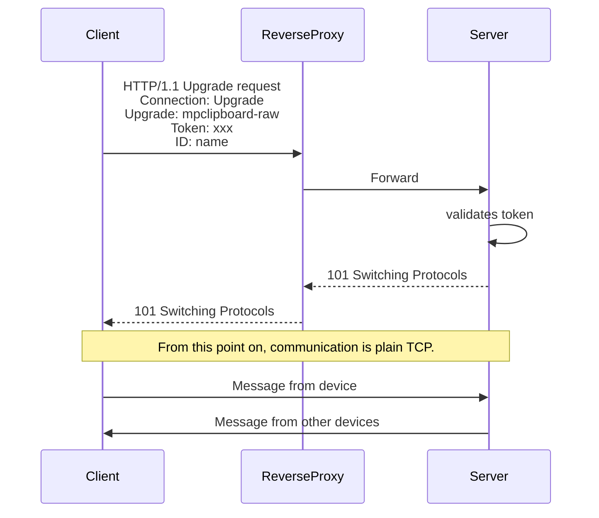

# `MPClipboard` server

This is the central part in communication process, a server that connects clients of all flavors.

It has only one endpoint: `/` that:

+ receives incoming TCP connections
+ performs authentication (and drops a connection if the token doesn't match)
+ does a handshake and switches to a raw TCP protocol
+ sends the most recent text to a newly connected client
+ starts receiving new texts from clients
+ broadcasts them to all connected clients

Authentication is based on a static token that is written in the `config.toml`.

The server itself doesn't handle any TLS, instead it expects a reverse proxy in front of it (Nginx/caddy/etc).

### Configuration

The config must be located at `/etc/mpclipboard-server/config.toml` and it must look like this:

```toml
url = "http://127.0.0.1:3000" # must have a http://host:port format
token = "s3cr3t"
```

### Building

```
cargo build --release
```

Additionally, there's a [`debian/mpclipboard-server.service`](/debian/mpclipboard-server.service) systemd service if you need it.

### Running in Docker

We provide a Docker image on ghcr.io (GitHub container registry).

First, you need a `config.toml` file. Then:

1. optionally enable logging
2. specify port mapping
3. mount volume with a config

```sh
docker run \
    -e RUST_LOG=trace
    -p 3000:3000 \
    -v ./config.toml:/etc/mpclipboard-server/config.toml:ro \
    ghcr.io/mpclipboard/server:latest
```

### Communication protocol

To support TLS termination communication must start with something that can be understood by a reverse proxy. We start with HTTP, an "Upgrade" request specifically. Once its finished reverse proxy simply transfers all trafic back and forth and does encyption/decryption transparently.


